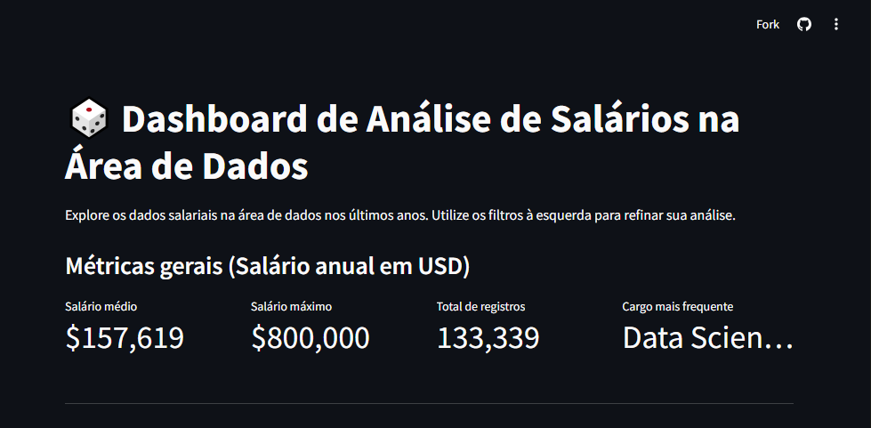
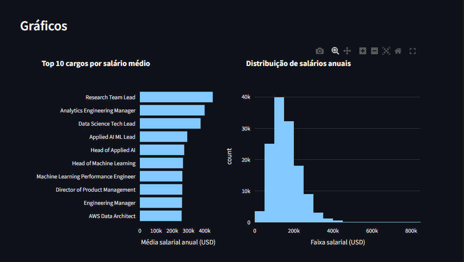
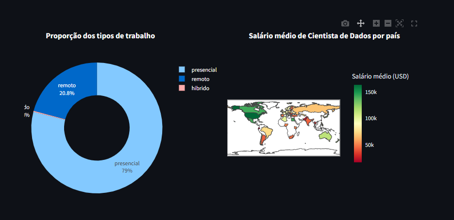
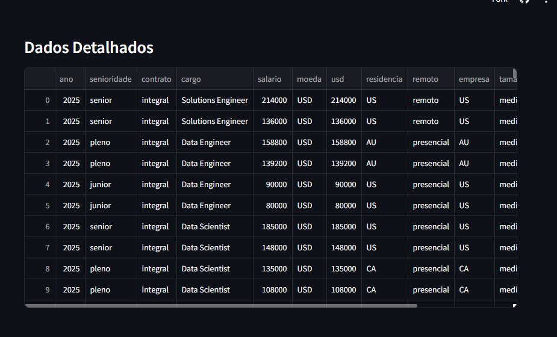
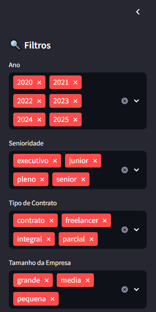

# 🎲 Dashboard de Análise de Salários na Área de Dados
Explore os dados salariais na área de dados nos últimos anos. Utilize os filtros à esquerda para refinar sua análise.

## 🎯 Objetivo Principal
O objetivo principal no desenvolvimento desse projeto era de aprender e conhecer mais sobre as posibilidades e ferramentas que a tecnologia **Python** Têm a oferecer por meio da utilização da manipulação de dados.

Consequi entender um pouco mais sobre ciências de dados e práticar consitos básicos fundamentais como:
- Análise com Pandas 
- Visualização 
- Dashboards

## 🧰 Tecnologias Utilizadas
| Tecnologias | Versão |
|-------------|--------|
| Python      | v3.13.6 |
| Pandas      | v2.2.3 |
| Streamlit   | v1.44.1 |
| Plotly      | v5.24.1 |
| Git         | V2.46.0 |

## ⚙️ Configuração do Ambiente Local
Para executar este projeto, siga os passos abaixo:

### 1. Criar o Ambiente Virtual
O ambiente virtual isola as dependências do projeto do seu Python global.

```
python -m venv .venv
```

### 2. Ativar o Ambiente
É crucial que o ambiente esteja ativo antes de instalar as bibliotecas.

- No Windows (Terminal PowerShell/CMD):
```
    .\.venv\Scripts\activate
```

- No Linux/Mac (ou Git Bash no Windows):
```
    source .venv/bin/activate
```

3. Instalar as Dependências
Com o ambiente ativo, instale todas as bibliotecas necessárias listadas no arquivo requirements.txt:

```
    pip install -r requirements.txt
```

## 📸 Imagens do Projeto
Todas as imagens do projeto mostrando o resultado final do desenvolvimento do projeto.










